# MERAKI_Academy_Project_5

<p align="center">
<a href="" target="_blank" rel="noopener noreferrer">
 
 </a>
</p>

<h3 align="center">Wash My Ride
</h3>

---

<p align="center"> An awesome Project to describe README 
    <br> 
<a href='https://652714b9c634f2238705857d--fanciful-twilight-37d544.netlify.app/'>Demo</a>
    <br> 
</p>

## 📝 Table of Contents

- [MERAKI\_Academy\_Project\_5](#meraki_academy_project_5)
  - [📝 Table of Contents](#-table-of-contents)
  - [🧐 About ](#-about-)
  - [🏁 Getting Started ](#-getting-started-)
    - [Prerequisites](#prerequisites)
    - [Installing:](#installing)
  - [🎈 Usage ](#-usage-)
  - [⛏️ Built Using ](#️-built-using-)
  - [User Story ](#user-story-)
  - [Data Flow ](#data-flow-)
  - [⚠️ Guided By ](#️-guided-by-)

## 🧐 About <a name = "about"></a>

Welcome to Wash My Ride Services! We are dedicated to providing top-notch car wash services right at your doorstep. Our team of skilled professionals is equipped with state-of-the-art tools and eco-friendly cleaning solutions to ensure your vehicle shines like new.

We understand that your time is valuable. That’s why we bring the car wash to you, whether you’re at home, at work, or anywhere else. Our services are designed to offer the utmost convenience without compromising on quality.

Our mission is to transform the traditional chore of car washing into a hassle-free experience. We aim to exceed customer expectations with our attention to detail, reliability, and exceptional customer service.

Join us on this journey and experience the new standard in car care!

## 🏁 Getting Started <a name = "getting_started"></a>

These instructions will get you a copy of the project up and running on your local machine for development and testing purposes.

### Prerequisites

- Visual Studio Code follow this <a href='https://code.visualstudio.com/download'>link</a> to install.
- Git Bash follow this <a href='https://git-scm.com/downloads'>link</a> to install.
- MongoDB follow this <a href='https://www.mongodb.com/products/tools/compass'>link</a> to install.
- Node.js follow this <a href='https://nodejs.org/en/download'>link</a> to install.

### Installing:

1. Clone the repo to your local machine using git bash.

```
git clone https://github.com/Tokens-Army/MERAKI_Academy_Project_5.git
```

2. Install packages repeat this step in backend and frontend folder

```
npm i
```

3. Run server using git bash inside backend folder

```
npm run dev
```

4. Run application using git bash inside frontend folder

```
npm run start
```

Now app ready to use

## 🎈 Usage <a name="usage"></a>


- You don't have to register to navigate our web app!
- Home
- 
- Register Page
- 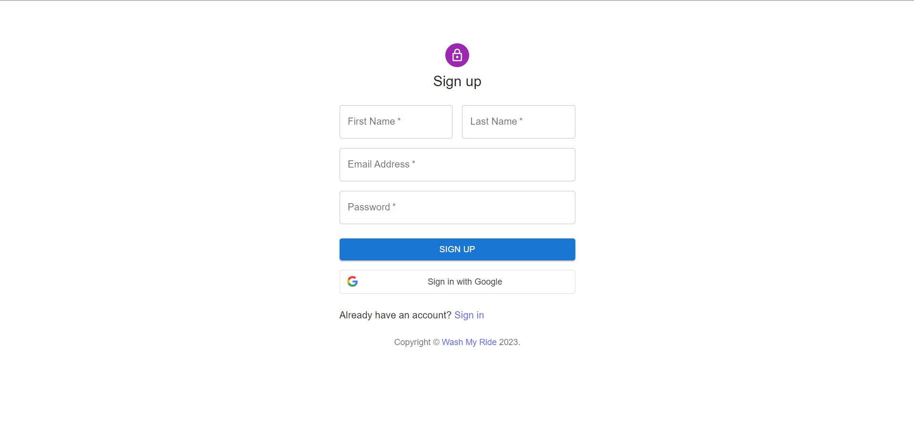
-  Login Page
- 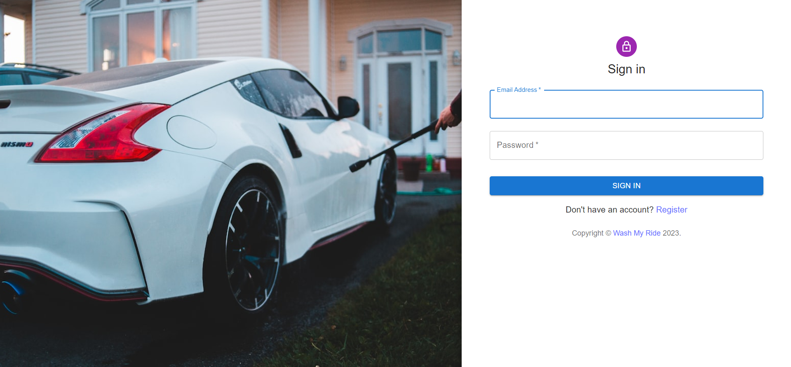
- Footer
- 
- About
- 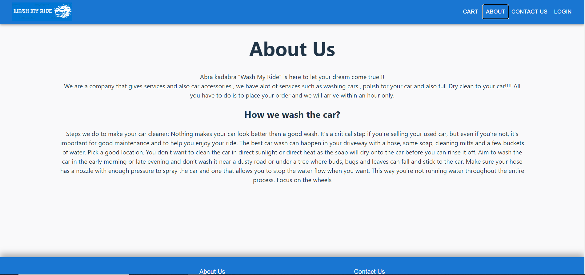
- Cart
- 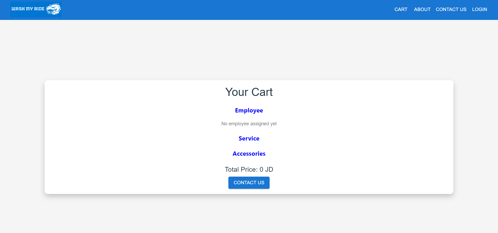
- Accessories page
- 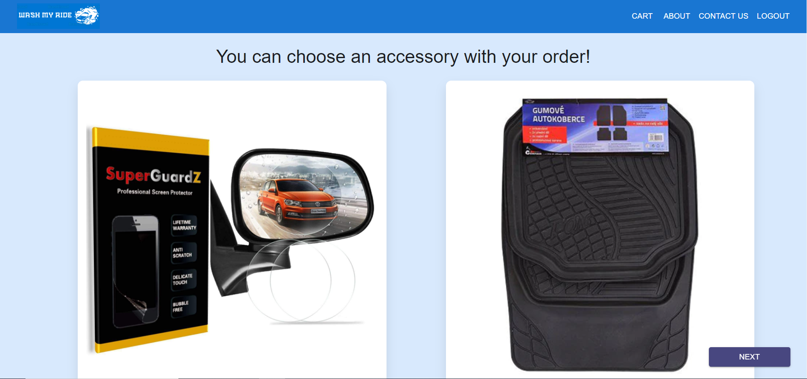
- Checkout page where you can schedule your order and put your location
- 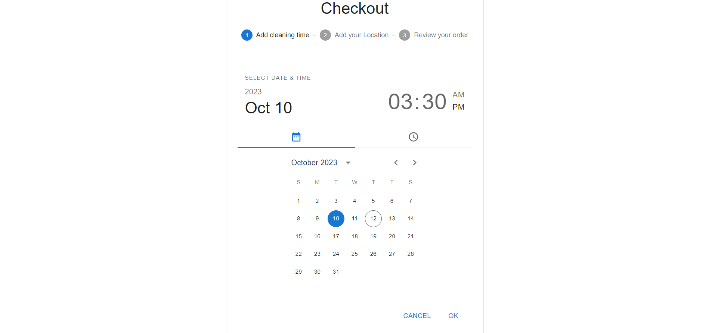
- Location
- 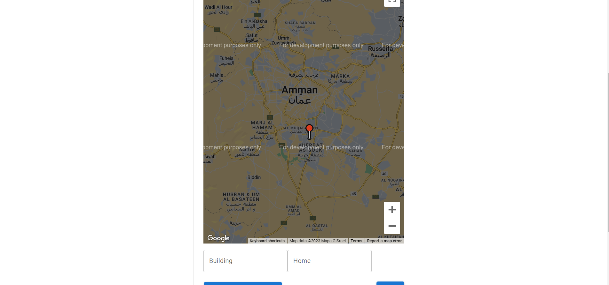
- Review your order page
- 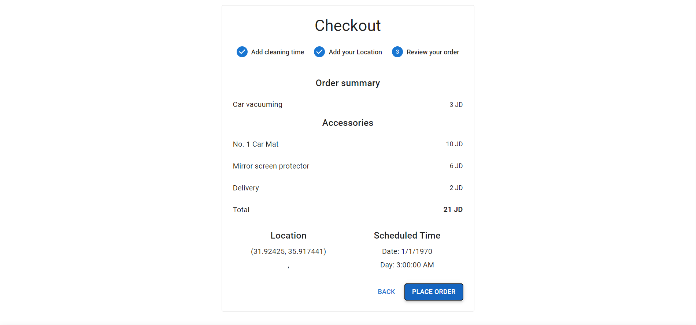
- Contact Us page where you can chat with the company
- 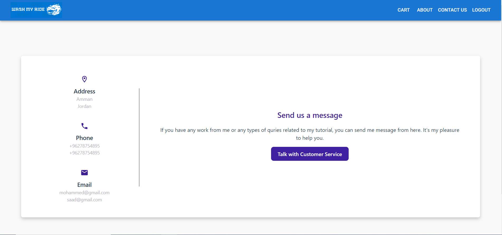
- Customer service chat
- 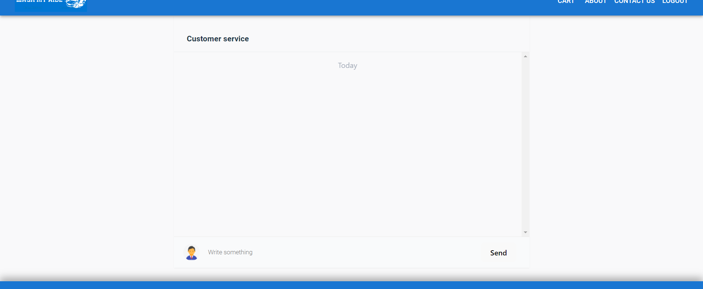
- Admin main page
- 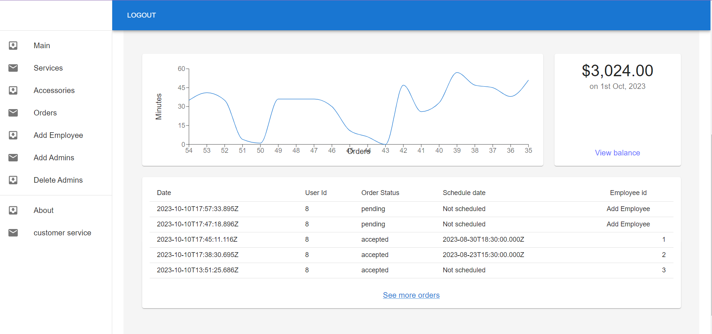
- Admin services page
- 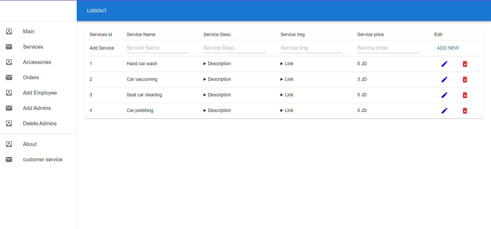
- Admin accessories page
- 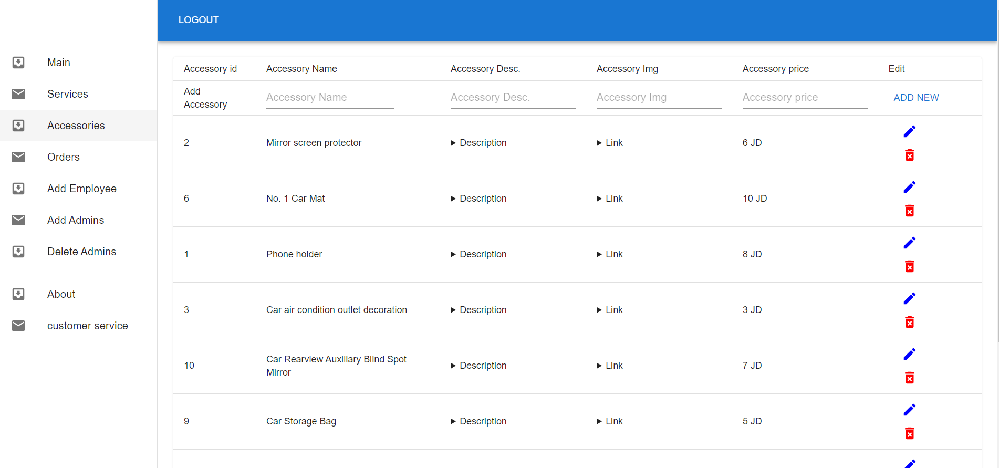
- Admin orders page
- 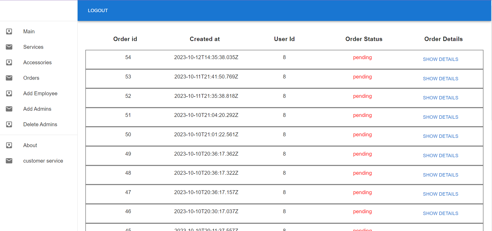
- Admin add employees page
- 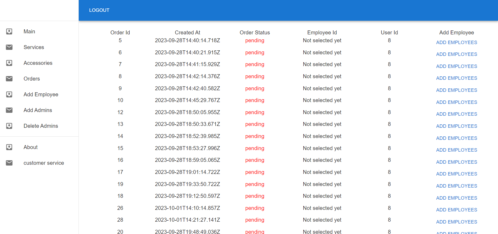
- Admin add admins page
- 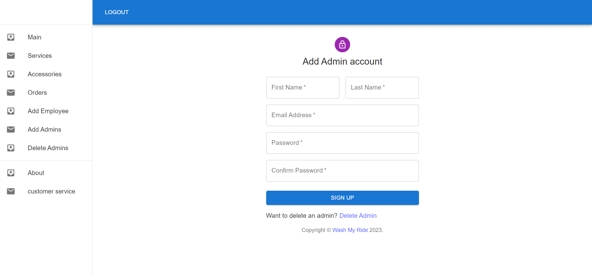
- Admin delete admins page
- 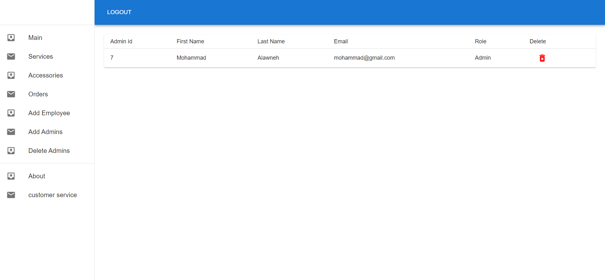
- Admin customer service page
- 


## ⛏️ Built Using <a name = "built_using"></a>

- [PostgreSQL](https://www.postgresql.org/) - Database
- [MongoDB](https://www.mongodb.com/) - Database
- [Node JS](https://nodejs.org/en/) - Server Environment
- [Express JS](https://expressjs.com/) - Server Framework
- [Socket.IO] (https://socket.io/) - Client/Server communication library
- [React JS](https://https://reactjs.org/) - Web Framework
- [Redux.JS] (https://redux.js.org/) - State management library
- [Material UI](https://mui.com/) - Style Framework

## User Story <a name = "#user_story"></a>

Trello board link
<a href="https://trello.com/b/onEhhYxU/tokens-army">Trello</a>

## Data Flow <a name = "#data_flow"></a>

</a>

## ⚠️ Guided By <a name = "guided_by"></a>

This project is guided by ©️ **[MERAKI Academy](https://www.meraki-academy.org)**